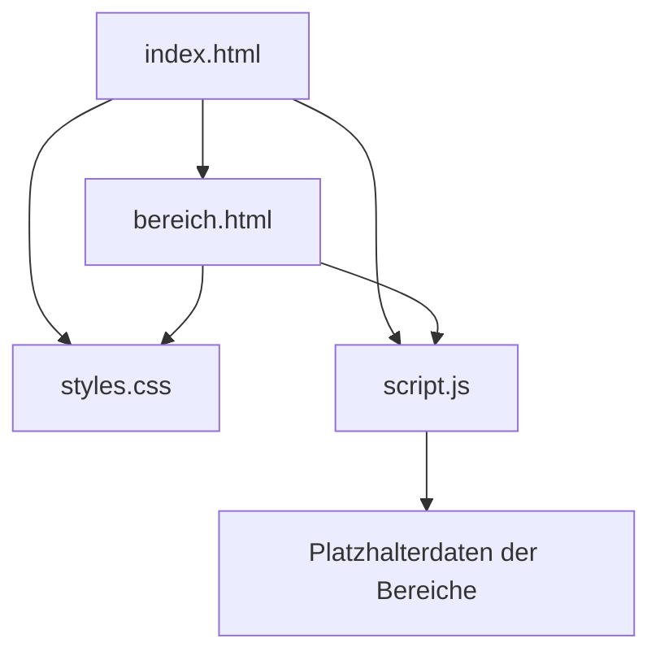

# Oktonia.info – Gesamtdokumentation

Stand: 30. August 2026

## 1. Projektziel

Oktonia.info soll ein ruhiges, bildorientiertes Informationsportal für das Dorf Oktonia werden. Zielgruppen sind Einwohner, ehemalige Einwohner, Besucher und Reisende. Die Website soll praktische Ortsinformationen mit Geschichte, Kultur und aktuellem Dorfleben verbinden.

Die Seite ist ausdrücklich kein lautes kommerzielles Reiseportal. Schwarz, Weiß und Grautöne bilden den Rahmen; später eingepflegte Fotografien sollen die visuelle Hauptrolle übernehmen.

## 2. Bisher festgelegte Anforderungen

- minimalistische, dezente Gestaltung
- große echte Bilder aus Oktonia und Umgebung
- zuerst mobil gut nutzbar, anschließend Desktop
- langfristig für Griechisch, Deutsch und Englisch vorbereitet
- einfache Pflege und geringe technische Abhängigkeiten
- externe Kontakt- und Buchungslinks statt eigener Buchungsplattform
- keine Zahlungen, Bewertungen, öffentlichen Kommentare oder Benutzerkonten in Version 1

## 3. Geplante Seiten und Inhalte

| Bereich | Geplante Inhalte |
| --- | --- |
| Start | Titelbild, Einführung, Direkteinstiege und aktuelle Meldung |
| Übernachten | Apartments, Ferienhäuser, Pensionen und externe Buchungslinks |
| Essen & Einkaufen | Tavernen, Restaurants, Cafés und weitere Geschäfte |
| Entdecken | Strände, Wanderwege, Aussichtspunkte und Ausflugsziele |
| Kirchen & Klöster | Geschichte, Lage, Besuchshinweise und Patronatsfeste |
| Geschichte | Chronik, historische Bilder, Quellen und Zeitzeugen |
| Dorfleben | Vereine, Veranstaltungen und Dorfzeitung |
| Rechtliches | Kontakt, Impressum und Datenschutz |

Die Dorfzeitung soll zunächst als PDF-Archiv nach Jahren und Ausgaben veröffentlicht werden. Später können einzelne Beiträge zusätzlich als HTML-Artikel erscheinen.

## 4. Gestaltungskonzept

### Visuelle Sprache

- gebrochen weißer Hintergrund
- fast schwarze Schrift
- feine Linien statt Kartenrahmen und Schatten
- großzügige Abstände
- große, asymmetrische Bildflächen
- typografische Wortmarke `OKTONIA.INFO`
- griechische Schreibweise `ΟΚΤΩΝΙΑ` als zurückhaltendes Gestaltungselement

### Platzhalterkonzept

Der aktuelle Stand verwendet bewusst neutrale graue Bildflächen mit Diagonalen. Sie zeigen Bildformat und Position, ohne fremde oder unpassende Fotos als vermeintliche Originalaufnahmen auszugeben.

### Barrierefreiheit

Vorgesehen sind semantisches HTML, Tastaturbedienung, sichtbare Fokusmarkierungen, ausreichende Kontraste, Alternativtexte, korrekte Sprachkennzeichnung und Unterstützung für reduzierte Bewegung.

## 5. Bisher umgesetzter Prototyp

Es existiert ein privater klickbarer Prototyp unter:

<https://oktonia-info.becker947832.chatgpt.site>

Er enthält:

- Startseite
- sechs verlinkte Themenbereiche
- wiederverwendbare Eintragskarten
- Desktop-, Tablet- und Mobilansicht
- Platzhalter für Bilder, Texte und Metadaten
- vorbereitete Sprachwahl DE/ΕΛ/EN

Der gehostete Entwurf verwendet intern eine moderne React/Vinext-Struktur. Die vorliegende Exportversion wurde zusätzlich als klassisches HTML/CSS/JavaScript-Projekt umgesetzt, damit sie unabhängig davon in GitHub, VS Code, GitHub Pages und auf einem eigenen VPS betrieben werden kann.

## 6. Aufbau der statischen HTML-Version

`index.html` enthält die Startseite. Alle Themenlinks führen zu `bereich.html` mit einem Parameter wie `?seite=entdecken`. `script.js` liest diesen Parameter und setzt Überschrift, Kategorien und Metadaten ein. Dadurch bleibt der Prototyp klein und pflegbar, obwohl er mehrere Bereiche simuliert.

Für die endgültige Suchmaschinenoptimierung sollten später echte einzelne URLs oder erzeugte HTML-Dateien pro Bereich verwendet werden, beispielsweise `/entdecken/index.html`.

## 7. Technische Zielarchitektur

### Version 1

- semantisches HTML5
- modernes CSS ohne UI-Framework
- möglichst wenig JavaScript
- keine Datenbank
- keine öffentliche Anmeldung
- Bilder als AVIF/WebP mit JPEG-Fallback
- Dorfzeitungen als optimierte PDFs
- HTTPS, Backups und Monitoring

### Möglicher späterer Ausbau

- strukturierte Inhalte aus Markdown oder JSON
- automatischer Generator für einzelne Sprach- und Detailseiten
- geschützte Redaktionsoberfläche
- Freigabestatus für Entwürfe
- Veranstaltungskalender
- browserfreundliche Artikelansicht der Dorfzeitung

## 8. Hostingvarianten

### GitHub Pages

Für den statischen Prototyp besonders einfach und zunächst ohne eigenen VPS nutzbar. Ein Push auf den Veröffentlichungsbranch kann die Seite automatisch aktualisieren.

### Eigener VPS

Empfohlen für vollständige Kontrolle und spätere Erweiterungen. Für die statische Seite reichen ungefähr 1 vCPU, 1 GB RAM und 10–20 GB SSD. Geeignet sind Debian Stable oder Ubuntu LTS mit Nginx oder Caddy.

### Entscheidungsempfehlung

Für die Inhalts- und Designphase zunächst GitHub plus GitHub Pages verwenden. Einen VPS erst bestellen, wenn eigene serverseitige Funktionen, ein CMS oder besondere Betriebsanforderungen tatsächlich benötigt werden.

## 9. Datenschutz, Rechte und Redaktion

Vor der öffentlichen Veröffentlichung werden benötigt:

- verantwortliche Stelle und Impressum
- Datenschutzerklärung
- dokumentierte Bild- und Textrechte
- Einwilligungen für erkennbare Personen
- Freigabe geschäftlicher Kontaktdaten
- Verantwortlichkeit für Vereins- und Zeitungsinhalte
- Korrektur- und Löschverfahren

Externe Karten sollen zunächst nur verlinkt oder erst nach bewusster Aktivierung geladen werden. Lokal eingebundene Schriften und der Verzicht auf unnötige Tracker reduzieren den Datenschutzaufwand.

## 10. Bereits vorhandene Planungsunterlagen

Im Verzeichnis `docs/planung/` liegen:

- Projektübersicht
- Seitenstruktur und Inhaltsfelder
- Design und Nutzerführung
- technische Requirements
- Umsetzungsplan
- offene Punkte und Inhaltscheckliste

## 11. Offene Entscheidungen

1. verantwortliche Organisation oder Person
2. Hauptsprache des ersten öffentlichen Stands
3. korrekte offizielle Ortsbezeichnung und Schreibweisen
4. Fotoarchiv und dokumentierte Rechte
5. Liste der Unterkünfte, Betriebe, Ziele und Vereine
6. Umfang und Herausgeberschaft der Dorfzeitung
7. GitHub-Konto beziehungsweise Organisation für das Repository
8. endgültige Hostingvariante
9. DNS-Anbieter und Zugang zur Domain `oktonia.info`

## 12. Empfohlene nächste Schritte

1. HTML-Projekt nach GitHub übertragen.
2. In VS Code öffnen und lokal prüfen.
3. GitHub Pages als vorläufige öffentliche Testumgebung aktivieren.
4. etwa 15 freigegebene repräsentative Bilder sammeln.
5. zentrale Inhaltsliste erstellen.
6. Startseite mit echten Basisinformationen befüllen.
7. erst danach Domain und endgültiges Hosting verbinden.

