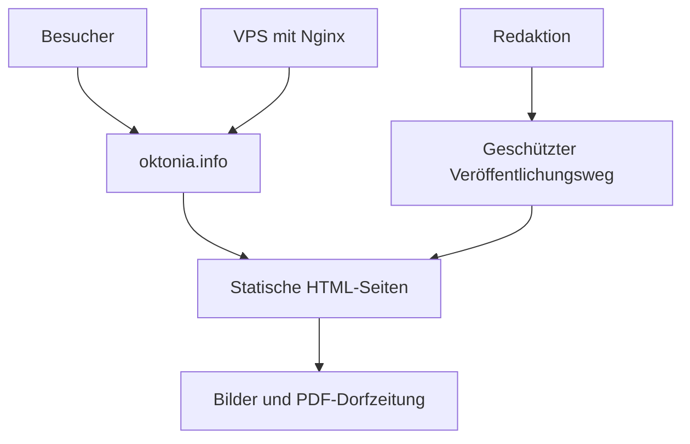

# Oktonia.info – Projektübersicht

## Ziel

Oktonia.info wird ein ruhiges, bildorientiertes Informationsportal für das Dorf Oktonia. Die Website richtet sich an Einwohner, ehemalige Einwohner, Besucher und Reisende. Sie verbindet praktische Ortsinformationen mit Geschichte, Kultur und dem aktuellen Dorfleben.

## Leitidee

- minimale Gestaltung in Schwarz, Weiß und Grautönen
- große, hochwertige Bilder stehen im Vordergrund
- schnelle Orientierung auf Mobilgeräten
- sachlich, lokal und nicht wie ein kommerzielles Reiseportal
- Inhalte langfristig einfach pflegbar
- Vorbereitung für mindestens Griechisch, Deutsch und Englisch

## Empfohlener Startumfang (MVP)

1. Startseite mit großem Ortsbild, kurzer Einführung und Direkteinstiegen
2. Unterkünfte mit Bildern, Kurzinfos und externen Buchungs- oder Kontaktlinks
3. Essen & Einkaufen mit Restaurants, Cafés, Tavernen und Geschäften
4. Entdecken mit Stränden, Wanderwegen und Ausflugszielen
5. Kirchen & Klöster
6. Geschichte des Dorfes
7. Dorfleben mit Vereinen und Dorfzeitung als PDF-Archiv
8. Kontakt, Impressum und Datenschutz

## Projektdateien

- `01-seitenstruktur-und-inhalte.md` – Navigation, Seitentypen und Inhaltsfelder
- `02-design-und-nutzerfuehrung.md` – visuelle Richtung und Bedienkonzept
- `03-technische-requirements.md` – Hosting, Architektur, Sicherheit und Betrieb
- `04-umsetzungsplan.md` – Phasen, Prioritäten und benötigte Zuarbeit
- `05-offene-punkte-und-inhaltscheckliste.md` – Entscheidungen und Materialsammlung

## Empfohlene Grundarchitektur

## Bewusste Abgrenzung für Version 1

Noch nicht notwendig sind Benutzerkonten, eine eigene Buchungsplattform, Onlinezahlungen, Bewertungen, Kommentare oder ein komplexes CMS. Externe Buchungslinks und direkte Kontaktdaten reichen zunächst aus. Dadurch bleibt die erste Version günstig und robust.

